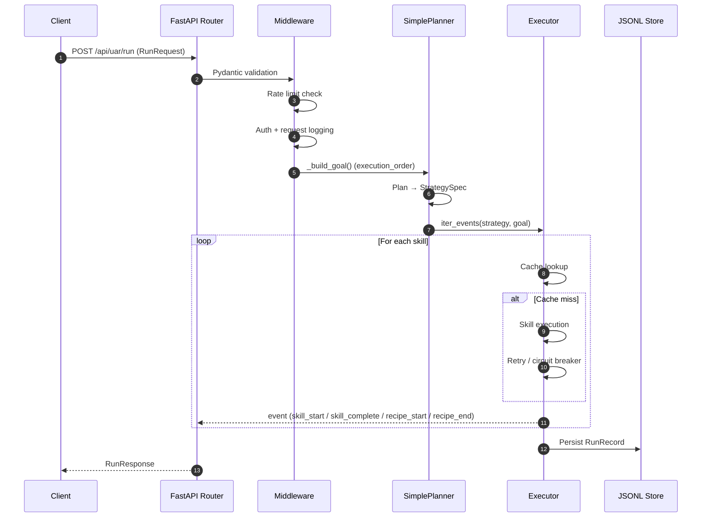

# UAR Architecture

**Version:** 1.1.0 (see `VERSION` file)  
**Last Updated:** 2026-05-30

---

## 1. System Overview

Universal Agent Runtime (UAR) is a modular, event-driven execution platform that operates as both an **agent runtime** (goal-oriented, event-streamed, observable workflows) and a **browser-accessible scientific computing sandbox** (quantum circuits, molecular dynamics, RISC-V emulation, Verilog simulation, astrophysics computations).

It consists of a Python backend (FastAPI + custom executor with 127 registered skills) and an optional React frontend, communicating over HTTP and WebSocket. Skills span AI/LLM integration, document processing, hardware emulation, embedded systems, and pure mathematics — all exposed through a unified JSON goal API.

## 2. High-Level Architecture

```
┌─────────────────────────────────────────────────────────────┐
│                      Client Layer                            │
│  ┌─────────────┐  ┌─────────────┐  ┌─────────────────────┐  │
│  │  React Web  │  │  curl / CLI │  │  External Services  │  │
│  │    (Vite)   │  │             │  │  (UOR, Hologram...) │  │
│  └──────┬──────┘  └──────┬──────┘  └──────────┬──────────┘  │
└─────────┼────────────────┼────────────────────┼─────────────┘
          │                │                    │
          └────────────────┼────────────────────┘
                           │ HTTP / WebSocket
┌──────────────────────────┼──────────────────────────────────┐
│                      API Layer (FastAPI)                     │
│  ┌──────────────┐  ┌──────────────┐  ┌──────────────────┐  │
│  │  /api/uar/run │  │ /api/uar/    │  │ /api/health/*    │  │
│  │  /api/uar/    │  │   stream/ws  │  │ /api/metrics     │  │
│  │   stream      │  │              │  │ /api/uar/recipes │  │
│  └──────┬───────┘  └──────┬───────┘  └────────┬───────────┘  │
│         │                 │                   │              │
│         └─────────────────┼───────────────────┘              │
│                           │                                  │
│  ┌────────────────────────┼─────────────────────────────┐   │
│  │              Middleware Pipeline                        │   │
│  │  CORS → Rate Limit → Auth → Logging → Body Parsing      │   │
│  └────────────────────────┼─────────────────────────────┘   │
└──────────────────────────┼──────────────────────────────────┘
                           │
┌──────────────────────────┼──────────────────────────────────┐
│                   Core Runtime Layer                         │
│  ┌──────────────┐  ┌──────────────┐  ┌──────────────────┐  │
│  │   Planner    │  │   Executor   │  │  Skill Registry    │  │
│  │  (strategy)  │  │ (event loop) │  │ (dynamic lookup)   │  │
│  └──────┬───────┘  └──────┬───────┘  └────────┬───────────┘  │
│         │                 │                   │              │
│         └─────────────────┼───────────────────┘              │
│                           │                                  │
│  ┌────────────────────────┼─────────────────────────────┐   │
│  │              Skill Execution Engine                     │   │
│  │  Sequential → Parallel → Retry → Circuit Breaker          │   │
│  │  Cache → Guardrails → Output Validation → Metrics       │   │
│  └────────────────────────┼─────────────────────────────┘   │
└──────────────────────────┼──────────────────────────────────┘
                           │
┌──────────────────────────┼──────────────────────────────────┐
│                   Persistence Layer                          │
│  ┌──────────────┐  ┌──────────────┐  ┌──────────────────┐  │
│  │ JSONL Store  │  │ Audit Logger │  │  Cache (optional)│  │
│  │ (run records)│  │(compliance)  │  │  Redis / in-mem   │  │
│  └──────────────┘  └──────────────┘  └──────────────────┘  │
└──────────────────────────────────────────────────────────────┘
```

## 3. Component Breakdown

### 3.1 API Layer (`uar/api/`)

| Component | File | Purpose |
|-----------|------|---------|
| **Server** | `server.py` | FastAPI app, endpoint definitions, lifespan management |
| **Middleware** | `middleware.py` | Rate limiting, auth, request logging, security headers |
| **Metrics** | `metrics.py` | Prometheus-compatible histograms, p50/p99 tracking |
| **Security** | `security.py` | CSP, CORS, input validation helpers |
| **Routers** | `routers/*.py` | UOR object endpoints, recipe CRUD, health probes |

### 3.2 Core Runtime (`uar/core/`)

| Component | File | Purpose |
|-----------|------|---------|
| **Planner** | `planner.py` | Converts GoalSpec + execution_order into StrategySpec |
| **Executor** | `executor.py` | Event-driven execution engine with retry, caching, guardrails |
| **Registry** | `registry.py` | Thread-safe skill registration and `@register_skill` decorator |
| **Contracts** | `contracts.py` | Dataclasses: PipelineContext, RunRecord, StrategySpec, GoalSpec |
| **Safe Eval** | `safe_eval.py` | Restricted AST expression evaluator for STEM skills |
| **Validation** | `validation.py` | Path traversal prevention, timeout validation |
| **Audit** | `audit.py` | JSONL audit logger for compliance |

### 3.3 Skills (`uar/skills/`)

| Category | Skills |
|----------|--------|
| **Document** | `doc_ingest`, `section_sum`, `sum_review` |
| **AI/LLM** | `ollama_generate` |
| **Knowledge Graph** | `graphrag_init`, `graphrag_index`, `graphrag_query` |
| **UOR Ecosystem** | `uor_foundation_verify`, `hologram_query`, `moltbook_*` |
| **STEM** | `scipy_opt`, `diff_eq_solve`, `qiskit_circuit`, `rdkit_*`, `relativity` |
| **ML/Data** | `optuna_tune`, `chromadb_store` |
| **CV** | `opencv_process`, `yolo_detect` |
| **Storage** | `autonomi_*` (experimental) |

### 3.4 Persistence (`uar/memory/`)

| Component | File | Purpose |
|-----------|------|---------|
| **JSONL Store** | `json_store.py` | Append-only run records with file locking |
| **Cache** | `cache.py` | Skill result caching (in-mem / Redis) |

## 4. Request Flow

### 4.1 HTTP Request (`POST /api/uar/run`)

```
Client Request
    │
    ▼
┌─────────────────┐
│  FastAPI Router │  ← Pydantic validation (RunRequest)
└────────┬────────┘
         │
    ┌────┴────┐
    ▼         ▼
┌────────┐ ┌────────┐
│ Rate   │ │ Auth   │  ← Per-skill rate limits, API key tiers
│ Limit  │ │        │
└───┬────┘ └────────┘
    │
    ▼
┌─────────────────┐
│ Request Logging │  ← Correlation ID, duration metrics, audit trail
└────────┬────────┘
         │
         ▼
┌─────────────────┐
│  _build_goal()  │  ← execution_order → ordered_skills + recipe_markers
└────────┬────────┘
         │
         ▼
┌─────────────────┐
│ SimplePlanner   │  ← GoalSpec → StrategySpec
└────────┬────────┘
         │
         ▼
┌─────────────────┐
│   Executor.run  │  ← Event loop: skill_start → skill_complete/failed
│                 │     Retry logic, circuit breaker, cache lookup
└────────┬────────┘
         │
         ▼
┌─────────────────┐
│  JSONL Store    │  ← Persist RunRecord
└────────┬────────┘
         │
         ▼
┌─────────────────┐
│  JSON Response    │  ← RunRecord serialized
└─────────────────┘
```



### 4.2 WebSocket Stream (`/api/uar/stream/ws`)

```
WebSocket Connect
    │
    ▼
┌─────────────────┐
│  Connection Cap │  ← Max 1000 concurrent WS connections
└────────┬────────┘
         │
         ▼
┌─────────────────┐
│  Rate Limit     │  ← Per-user/skill limits
└────────┬────────┘
         │
         ▼
┌─────────────────┐
│  Auth (Bearer)  │  ← Token from header or query param
└────────┬────────┘
         │
         ▼
┌─────────────────┐
│  Executor.stream│  ← Async generator yields events
│                 │     start → recipe_start → skill_start → skill_complete → recipe_end → metrics → complete
└────────┬────────┘
         │
         ▼
┌─────────────────┐
│  Binary Viz     │  ← Optional base64 visualization for skill_complete
└─────────────────┘
```

## 5. Data Model

### 5.1 Core Types

```python
# GoalSpec — what the user wants
class GoalSpec:
    objective: str          # Natural language goal
    metadata: dict          # input_path, auto_sum_review, etc.
    execution_order: list   # Unified skill + recipe order

# StrategySpec — how to execute
class StrategySpec:
    ordered_skills: list[str]      # Flattened skill names
    recipe_markers: list[dict]     # Recipe boundaries for nesting
    parallel_groups: list[list]    # Skills that can run in parallel

# RunRecord — what happened
@dataclass
class RunRecord:
    run_id: UUID
    goal_id: UUID
    skills: list[str]
    outputs: list[dict]
    status: str             # "completed" | "partial" | "failed"
    errors: list[str]
    events: list[dict]
    final_context: dict
    user_id: str | None
```

### 5.2 Event Schema

```python
{
    "type": "skill_start" | "skill_complete" | "skill_failed" |
            "skill_retry" | "recipe_start" | "recipe_end" |
            "metrics" | "start" | "complete",
    "skill": str,           # Skill name (if applicable)
    "recipe": str,          # Recipe name (if applicable)
    "timestamp": float,     # Unix epoch
    "error": str | None,
    "payload": dict,        # Skill-specific output
    "request_id": str,
    "correlation_id": str,
}
```

## 6. Security Architecture

```
┌─────────────────────────────────────────────────────┐
│                    Perimeter                         │
│  CORS origins whitelist → CSP headers → HSTS       │
└────────────────────┬────────────────────────────────┘
                     │
┌────────────────────┼────────────────────────────────┐
│                Transport                             │
│  TLS termination → Request body size limit (50MB)    │
└────────────────────┬────────────────────────────────┘
                     │
┌────────────────────┼────────────────────────────────┐
│                Authentication                        │
│  API Key (Bearer) → Tier-based rate limits          │
│  Metrics API Key (optional, production)             │
└────────────────────┬────────────────────────────────┘
                     │
┌────────────────────┼────────────────────────────────┐
│              Authorization                           │
│  Resource ownership checks → Canonical recipe locks  │
└────────────────────┬────────────────────────────────┘
                     │
┌────────────────────┼────────────────────────────────┐
│              Application Security                    │
│  Path traversal validation → File size/count caps   │
│  safe_eval (AST) → SSRF prevention                  │
│  Input guardrails → Output guardrails               │
└─────────────────────────────────────────────────────┘
```

## 7. Deployment Architecture

### 7.1 Local Development

```
┌─────────────┐     ┌─────────────┐
│  React Dev  │────▶│  Vite HMR   │  http://localhost:5173
│   Server    │     │   (5173)    │
└─────────────┘     └─────────────┘
                           │
┌─────────────┐     ┌──────┴──────┐
│   Uvicorn   │────▶│  FastAPI    │  http://localhost:8000
│   (8000)    │     │   (API)     │
└─────────────┘     └──────┬──────┘
                           │
                    ┌──────┴──────┐
                    │  JSONL Store │  ./runs/
                    │  (optional)  │
                    └─────────────┘
```

### 7.2 Production (Docker Compose)

```
┌─────────────────────────────────────────────────────────────┐
│                         Nginx (reverse proxy)                  │
│                    TLS termination, static files               │
└──────────────────────┬────────────────────────────────────────┘
                       │
        ┌──────────────┼──────────────┐
        │              │              │
   ┌────▼────┐    ┌────▼────┐    ┌────▼────┐
   │ UAR API │    │ UAR API │    │ UAR API │  ← Uvicorn workers
   │  (8000) │    │  (8000) │    │  (8000) │     Gunicorn/Uvicorn
   └────┬────┘    └────┬────┘    └────┬────┘
        │              │              │
        └──────────────┼──────────────┘
                       │
              ┌────────▼────────┐
              │     Redis       │  ← Shared rate limits, skill cache
              │   (optional)    │
              └─────────────────┘
                       │
              ┌────────▼────────┐
              │  JSONL / SQLite │  ← Run persistence
              │   (mounted vol) │
              └─────────────────┘
```

## 8. Monitoring & Observability

```
┌─────────────────────────────────────────────────────────────┐
│                        Metrics Pipeline                        │
│                                                                │
│  Request ──▶ MetricsCollector ──▶ /api/metrics (Prometheus) │
│              (histograms, p50/p99)                             │
│                                                                │
│  Skill  ────▶ record_skill() ─────▶ uar_skill_duration_seconds │
│  Execution                                                    │
│                                                                │
│  Health ────▶ /api/health/live  ──▶ K8s liveness probe         │
│  Checks    ──▶ /api/health/ready ──▶ K8s readiness probe       │
│                                                                │
│  Audit  ────▶ JSONL audit.log ───▶ Compliance / forensics     │
└─────────────────────────────────────────────────────────────┘
```

## 9. Key Design Decisions

| Decision | Rationale |
|----------|-----------|
| **JSONL over SQL** | Append-only, file-locked, no schema migrations for v1 |
| **In-memory rate limiter default** | Zero-dependency startup; Redis for production multi-worker |
| **Event streaming over polling** | Real-time UX, backpressure via client ACK |
| **Skill registry at module load** | Decorator-based registration, no central registry file |
| **Recipe expansion at request time** | Execution_order allows mixing skills + recipes dynamically |
| **AST-based safe_eval** | Prevents sandbox escape vs `eval()` in STEM skills |

## 10. Extension Points

| Extension | How |
|-----------|-----|
| **New Skill** | `@register_skill("name")` decorator in `uar/skills/` |
| **New Recipe** | Add to `DEFAULT_RECIPES` in `uar/core/recipes.py` |
| **Custom Middleware** | Add to middleware pipeline in `uar/api/middleware.py` |
| **New Store Backend** | Implement `BaseStore` interface in `uar/memory/` |
| **Custom Planner** | Subclass `BasePlanner`, inject in `server.py` |

---

*See also:*
- [System Guide](../SYSTEM.md) — Internal development guide
- [Onboarding Guide](../ONBOARDING.md) — Zero-to-running for new users
- [SLA](SLA.md) — Service level objectives and monitoring gaps
- [Boot & Shutdown](BOOT_AND_SHUTDOWN.md) — Detailed startup/shutdown sequences
