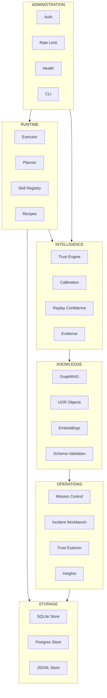

# UAR Architecture Map

> Navigation guide for engineers. Every significant component is placed in exactly one domain.  
> Last updated: 2026-06-01

---

## Domain Overview



---

## RUNTIME

**Entry point:** `uar/boot.py`  
**Question:** "How does a run go from request to result?"

| Component | File | Role |
|---|---|---|
| Executor | `uar/core/executor.py` | Skill dispatch, coalesce lock, parallel context |
| Orchestrator | `uar/core/orchestrator.py` | High-level run coordination |
| Scheduler | `uar/core/scheduler.py` | Deferred / timed execution |
| Contracts | `uar/core/contracts.py` | `PipelineContext`, `RunRecord` — shared data shapes |
| Recipes | `uar/core/recipes.py` | Recipe expansion and composition |
| Recipes service | `uar/services/recipes.py` | Service-layer recipe execution |
| Execution service | `uar/services/execution.py` | Run lifecycle management |
| Skill registry | `uar/core/registry.py` | Skill lookup and registration |
| Skill cache | `uar/core/skill_cache.py` | Warm/cold skill result caching |
| Safe eval | `uar/core/safe_eval.py` | Sandboxed expression evaluation |
| Sandbox | `uar/core/sandbox.py` | Skill isolation boundary |
| Agent framework | `uar/core/agent_framework.py` | Multi-agent planner integration |
| Planner | `uar/core/planner.py` | Goal decomposition |

### Skills library (`uar/skills/`)

Skills are registered capabilities, not services. Add new ones here; never in `uar/core/`.

| Category | Files |
|---|---|
| LLM providers | `llm_base.py`, `openai_skills.py`, `anthropic_skills.py`, `gemini_skills.py`, `groq_skills.py`, `mistral_skills.py`, `lm_studio_skills.py`, `together_skills.py`, `ollama_generate.py`, `huggingface_skills.py` |
| Math / Science | `math_compute.py`, `math_plot.py`, `math_plot_3d.py`, `physics_compute.py`, `quantum_circuit_visualization.py`, `quantum_ml.py`, `molecular_visualization.py`, `cern_root.py` |
| Hardware / Simulation | `riscv_sim.py`, `riscv_cycle.py`, `fpga_verify.py`, `verilator_sim.py`, `verilog_parse.py`, `myhdl_design.py`, `micropython.py`, `platformio.py` |
| Data / ML | `data_engineering.py`, `ml_tools.py`, `mlops_security.py`, `cv_skills.py`, `data_viz_3d.py` |
| Document / Code | `doc_ingest.py`, `doc_ingest_enhanced.py`, `code_analysis.py`, `graphrag_skills.py` |
| Blockchain / Storage | `blockchain.py`, `autonomi_storage.py` |
| Crypto / Security | `cipher_ops.py` |
| External integrations | `advanced_integrations.py`, `uor_ecosystem_skills.py` |
| Stubs / Aliases | `stub_skills.py`, `alias_skills.py` |
| Plugin system | `plugin.py`, `plugins/` |

### API surface (runtime)

| Router | Prefix | File |
|---|---|---|
| Runs | `/api/uar/runs` | `uar/api/routers/runs.py` |
| Streaming | `/api/uar/stream` | `uar/api/routers/streaming.py` |
| Recipes | `/api/uar/recipes` | `uar/api/routers/recipes.py` |

---

## INTELLIGENCE

**Entry point:** `uar/core/trust_ranking.py`  
**Question:** "Why was this skill recommended over another?"

> **Learning Freeze v1 is ACTIVE.** No new learning logic until Ω-7B.1 Operational Validation completes.

| Component | File | Role |
|---|---|---|
| Trust engine | `uar/core/trust_engine.py` | Composite trust score computation |
| Trust ranking | `uar/core/trust_ranking.py` | Soft blend (0.7 confidence + 0.3 trust) |
| Adaptive confidence | `uar/core/adaptive_confidence.py` | Per-skill confidence estimation |
| Calibration | `uar/core/calibration.py` | Confidence bucket calibration |
| Effectiveness ranking | `uar/core/effectiveness_ranking.py` | Historical success weighting |
| Operational learning | `uar/core/operational_learning.py` | Outcome-driven weight adjustment |
| Multi-run intelligence | `uar/core/multi_run_intelligence.py` | Cross-run pattern detection |
| Evidence | `uar/core/evidence.py` | Evidence collection for trust inputs |
| Replay confidence | `uar/core/replay_confidence.py` | Confidence curves over replay |
| Replay | `uar/core/replay.py` | Run replay engine |
| Provenance | `uar/core/provenance.py` | Lineage tracking |
| Audit | `uar/core/audit.py` | Immutable event audit trail |
| Timeline | `uar/core/timeline.py` | Run timeline construction |

### API surface (intelligence)

| Router | Prefix | File |
|---|---|---|
| Recommendations | `/api/uar/recommendations` | inside `uar/api/routers/uor.py` |
| Replay confidence | `/api/uar/replay_confidence` | `uar/api/routers/replay_confidence.py` |
| Replay explorer | `/api/uar/replay` | `uar/api/routers/replay_explorer.py` |
| Trust explorer | `/api/uar/operator/trust` | `uar/api/routers/operator/trust_explorer.py` |

---

## KNOWLEDGE

**Entry point:** `uar/uor/__init__.py`  
**Question:** "What does the system know and how is it structured?"

| Component | File | Role |
|---|---|---|
| UOR object model | `uar/uor/__init__.py` | Core UOR type definitions |
| Execution records | `uar/uor/execution_records.py` | Structured run records |
| Batch operations | `uar/uor/batch_operations.py` | Bulk object processing |
| Graph integration | `uar/uor/graph_integration.py` | Graph ↔ UOR bridge |
| Identity | `uar/uor/identity.py` | Object identity and addressing |
| Merkle | `uar/uor/merkle.py` | Content-addressed integrity |
| Schema validation | `uar/uor/schema_validation.py` | JSON Schema enforcement |
| SHACL validation | `uar/uor/shacl_validation.py` | RDF shape constraints |
| RDF formats | `uar/uor/rdf_formats.py` | Serialization (Turtle, N-Triples, JSON-LD) |
| Secure keys | `uar/uor/secure_keys.py` | Key derivation |
| Hash set ops | `uar/uor/hash_set_operations.py` | Digest-based set operations |
| Object cache | `uar/uor/object_cache.py` | LRU object cache |
| Object modes | `uar/uor/object_modes.py` | Read / write / sealed modes |
| Mode access controls | `uar/uor/mode_access_controls.py` | Permission matrix |
| Rate limiting (UOR) | `uar/uor/rate_limiting.py` | Object-level rate limits |
| Async resolution | `uar/uor/async_resolution.py` | Non-blocking object resolution |
| DNS resolution | `uar/uor/dns_resolution.py` | UOR address DNS binding |
| Links | `uar/uor/links.py` | Inter-object link graph |
| Lie groups | `uar/uor/lie_groups.py` | Mathematical transformations |
| Math transformations | `uar/uor/math_transformations.py` | Geometric ops |
| Bounded JSON | `uar/uor/bounded_json.py` | Size-capped JSON serialization |
| Digest validation | `uar/uor/digest_validation.py` | Hash verification |
| GraphRAG | `uar/core/flexible_graphrag.py` | Flexible graph retrieval-augmented generation |
| LlamaIndex RAG | `uar/core/llamaindex_rag.py` | Document RAG via LlamaIndex |
| Atlas embeddings | `uar/core/atlas_embeddings.py` | Embedding store |
| UOR vector ops | `uar/core/uor_vector_ops.py` | Vector similarity |
| UOR ecosystem | `uar/core/uor_ecosystem.py` | Full ecosystem orchestration |
| UOR helpers | `uar/core/uor_helpers.py` | Utility functions |
| UOR integration | `uar/core/uor_integration.py` | External system integration |

### API surface (knowledge)

| Router | Prefix | File |
|---|---|---|
| UOR core | `/api/uar` | `uar/api/routers/uor.py` |
| Graph | `/api/uar/operator/graph` | `uar/api/routers/operator/graph.py` |
| Search | `/api/uar/operator/search` | `uar/api/routers/operator/search.py` |
| Topology | `/api/uar/topology` | `uar/api/routers/topology.py` |

---

## OPERATIONS

**Entry point:** `uar/api/routers/operator/`  
**Question:** "What is the system doing right now, and what happened before?"

All operator routes live under `/api/uar/operator/`.

| Router | Sub-path | File | Role |
|---|---|---|---|
| Briefing | `/briefing` | `operator/briefing.py` | Daily operational summary |
| Inbox | `/inbox` | `operator/inbox.py` | Pending items requiring attention |
| Incidents | `/incidents` | `operator/incidents.py` | Incident lifecycle |
| Investigations | `/investigations` | `operator/investigations.py` | Deep-dive root cause |
| Reports | `/reports` | `operator/reports.py` | Scheduled and on-demand reports |
| Insights | `/insights` | `operator/insights.py` | Anomaly and pattern insights |
| Analytics | `/analytics` | `operator/analytics.py` | Trend and histogram analytics |
| Time machine | `/time_machine` | `operator/time_machine.py` | Historical state reconstruction |
| Trust explorer | `/trust` | `operator/trust_explorer.py` | Trust score inspection |
| Common | — | `operator/common.py` | Shared operator utilities |

Supporting core modules:

| Component | File | Role |
|---|---|---|
| Mission control | `uar/core/mission_control.py` | Aggregated system status |
| Analytics snapshot | `uar/core/analytics_snapshot.py` | Point-in-time analytics capture |
| Analytics cache | `uar/core/analytics_cache.py` | Cache layer for analytics |
| Certification | `uar/core/certification.py` | Operational certification checks |
| Validation | `uar/core/validation.py` | Run output validation |
| Validation utils | `uar/core/validation_utils.py` | Shared validation helpers |
| Governance | `uar/core/governance.py` | Policy enforcement |
| Ego guard / Forge | `uar/core/ego_guard_forge.py` | Guardrail composition |
| Guardrails | `uar/core/guardrails.py` | Content and behavioral guardrails |

### Dedicated routers (non-operator prefix)

| Router | Prefix | File |
|---|---|---|
| Mission control | `/api/uar/mission_control` | `uar/api/routers/mission_control.py` |
| Burn-in | `/api/uar/burn_in` | `uar/api/routers/burn_in.py` |
| Certification | `/api/uar/certification` | `uar/api/routers/certification.py` |

---

## STORAGE

**Entry point:** `uar/memory/base_store.py`  
**Question:** "Where does data live and how is it persisted?"

| Component | File | Role |
|---|---|---|
| Base store | `uar/memory/base_store.py` | Abstract store interface |
| SQLite store | `uar/memory/sqlite_store.py` | Primary embedded store (writer thread + WAL) |
| Postgres store | `uar/memory/postgres_store.py` | Production relational store |
| JSON store | `uar/memory/json_store.py` | Lightweight flat-file store |
| Events service | `uar/services/events.py` | Event bus and delivery |

**Metadata strategy:** Workflow state that does not need to be queried relationally is stored via `put_metadata()` / `get_metadata()` on the store rather than as dedicated tables. This reduces migration risk. Watch for hot paths that need promotion to real columns as query volume grows.

**Schema migrations:** `migrations/` — Alembic-managed, applies to Postgres only.

---

## ADMINISTRATION

**Entry point:** `uar/config.py`  
**Question:** "How is the system configured, secured, and monitored?"

| Component | File | Role |
|---|---|---|
| Config | `uar/config.py` | All environment variables and feature flags |
| Advanced config | `uar/config_advanced.py` | Tuning parameters (timeouts, thresholds) |
| Auth service | `uar/services/auth.py` | API key and bearer token validation |
| Rate limit service | `uar/services/rate_limit.py` | Request rate limiting |
| Security | `uar/security/` | Security primitives |
| Distributed | `uar/core/distributed.py` | Multi-node coordination |
| Circuit breaker | `uar/core/circuit_breaker.py` | Failure isolation |
| Circuit breaker decorator | `uar/core/circuit_breaker_decorator.py` | `@circuit_breaker` annotation |
| Retry decorator | `uar/core/retry_decorator.py` | `@retry` annotation |
| HTTP client | `uar/core/http_client.py` | Shared async HTTP session pool |
| Async utils | `uar/core/async_utils.py` | `run_sync_safe`, event-loop helpers |
| Safe utils | `uar/core/safe_utils.py` | `monotonic_timeout`, defensive helpers |
| JSON utils | `uar/core/json_utils.py` | Safe serialization helpers |
| Pagination | `uar/core/pagination.py` | Cursor-based pagination |
| Schema | `uar/core/schema.py` | Shared Pydantic base models |
| Exceptions | `uar/core/exceptions.py` | Exception hierarchy |
| Compat | `uar/core/compat.py` | Python version compatibility shims |
| Cache | `uar/core/cache.py` | In-process cache primitives |
| Cache backends | `uar/core/cache_backends.py` | Redis, memcached, memory backends |
| CLI | `uar/cli/` | `main.py`, `run.py` — operator CLI |
| Docs router | `/api/docs` | `uar/api/routers/docs.py` |
| Health router | `/api/health` | `uar/api/routers/health.py` |
| Metrics router | `/api/metrics` | `uar/api/routers/metrics.py` |
| Runtime health router | `/api/uar/runtime_health` | `uar/api/routers/runtime_health.py` |

### External integrations (`uar/integrations/`)

These are adapters, not core logic.

| Integration | Role |
|---|---|
| CrewAI | `uar/core/crewai_integration.py`, `crewai_real.py` |
| Dagster | `uar/core/dagster_orchestration.py` |
| Prism | `uar/core/prism_integration.py` |
| Sigmatics | `uar/core/sigmatics_integration.py` |
| n8n | `integrations/n8n/` |
| MCP | `uar/mcp/` |

---

## Observability Stack

Deployed separately; talks to UAR via Prometheus scrape and Loki push.

```
Prometheus  →  prometheus.yml / observability/
Grafana     →  deploy/grafana/dashboards/
Alertmanager → observability/alertmanager.yml
Loki        →  observability/loki.yml
Blackbox    →  observability/blackbox.yml
```

---

## Where Does This Belong?

Use this decision tree when adding new code:

```
Is it a callable capability invoked by the executor?
  YES → uar/skills/

Is it shared logic used by ≥2 skills or services?
  YES → uar/core/

Is it an operator-facing HTTP endpoint?
  YES → uar/api/routers/operator/

Is it a runtime HTTP endpoint (runs, streaming, recipes)?
  YES → uar/api/routers/

Is it data persistence?
  YES → uar/memory/

Is it a UOR object, identity, or graph primitive?
  YES → uar/uor/

Is it configuration or a cross-cutting concern (auth, rate limit, circuit breaker)?
  YES → uar/services/ or uar/core/ (infrastructure files)
```

---

## Technical Debt Watchlist

| Area | Risk | Notes |
|---|---|---|
| `executor.py` (~96 KB) | Medium | Largest single file; coalesce + parallel context complexity |
| `mission_control.py` router (~43 KB) | Medium | Still large despite operator/ refactor |
| `streaming.py` (~34 KB) | Medium | WebSocket + SSE in one file |
| `runs.py` (~32 KB) | Medium | Run CRUD + history + replay in one file |
| Metadata growth | Medium | Monitor for hot-path queries that need real columns |
| Knowledge Graph scaling | Future | Graph + vector ops will need sharding at volume |
| `UARPanel.tsx` | Medium | Frontend panel accumulating state; watch for split opportunity |

---

## Key Architectural Decisions

| ADR | Decision |
|---|---|
| ADR-001 | Circuit breaker pattern for skill failures |
| ADR-002 | Two-level caching strategy (in-process + backend) |
| ADR-003 | Skill registry pattern (not plugin discovery at runtime) |
| ADR-004 | One UAR: single executable, single store |
| ADR-005 | Service layer between routers and core |
