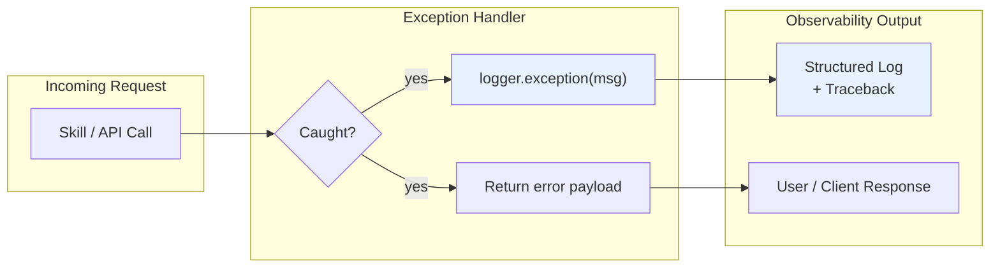

# Logging Patterns & Conventions

**Version:** 1.1.0
**Last Updated:** 2026-05-27

---

## Overview

UAR uses Python's standard `logging` module with a single, consistent style across all backend modules. This document describes the conventions and rationale.

---

## 1. %-Style Lazy Formatting

Always use %-style formatting with the logger's native argument substitution. This defers string interpolation until the log record is actually emitted (respects the effective log level).

```python
# Good — deferred formatting, no work if level is WARNING+
logger.info("User %s authenticated from %s", user, host)

# Bad — string built eagerly even if discarded
logger.info(f"User {user} authenticated from {host}")
```

---

## 2. `logger.exception()` for Catch-All Handlers

Inside `except Exception:` blocks, use `logger.exception()` to automatically capture the active traceback. Never use `logger.error()` without `exc_info=True` in these contexts.

```python
# Good — traceback captured automatically
try:
    result = risky_operation()
except Exception:
    logger.exception("Risky operation failed")
    return {"error": "failed"}

# Bad — traceback silently lost
except Exception:
    logger.error("Risky operation failed")
```

---

## 3. Preserve Diagnostic Context

When replacing `f"Error: {e}"` with lazy logging, ensure the exception detail is not lost:

- **Log message only:** `logger.exception("Operation failed")` — includes traceback
- **Log message + custom text:** `logger.exception("Query %s failed", query_id)`
- **User-facing response:** Keep `f"Error: {exc}"` in return value, separate from log call

```python
# Backend endpoint: log gets traceback, response gets summary
try:
    data = query_graph(query)
except Exception as exc:
    logger.exception("Graph query failed for %s", query)
    return {"error": f"Query failed: {exc}"}  # user-facing detail preserved
```

---

## 4. Frontend Error Handling

React components should distinguish between:

- **Empty state** — legitimate empty data: show `"(none)"` or `"(empty)"`
- **Error state** — fetch/network failure: show red error text + `console.error()`

```tsx
// Good
{!presetsLoaded && <span>(loading…)</span>}
{presetsError && <span className={styles.errorText}>Failed to load presets</span>}
{!presetsError && presets.length === 0 && <span>(none)</span>}

// Bad — swallows failure
.catch(() => { setPresetsLoaded(true) })  // looks like empty, not error
```

---

## 5. mermaid diagram



---

## Module Coverage

The following modules follow these conventions (refactored 2026-05-27):

- `uar/api/` — server, middleware, advanced endpoints
- `uar/core/` — executor, contracts, skill cache, circuit breaker
- `uar/skills/` — all skill modules
- `uar/uor/` — UOR integration modules
- `uar/compat/` — manifest and sigstore signing
- `uar/memory/` — Postgres and SQLite stores
- `uar/objects/` — ALM client
- `uar/insurance/` — actuarial collector
- `uar/mcp/` — MCP server
