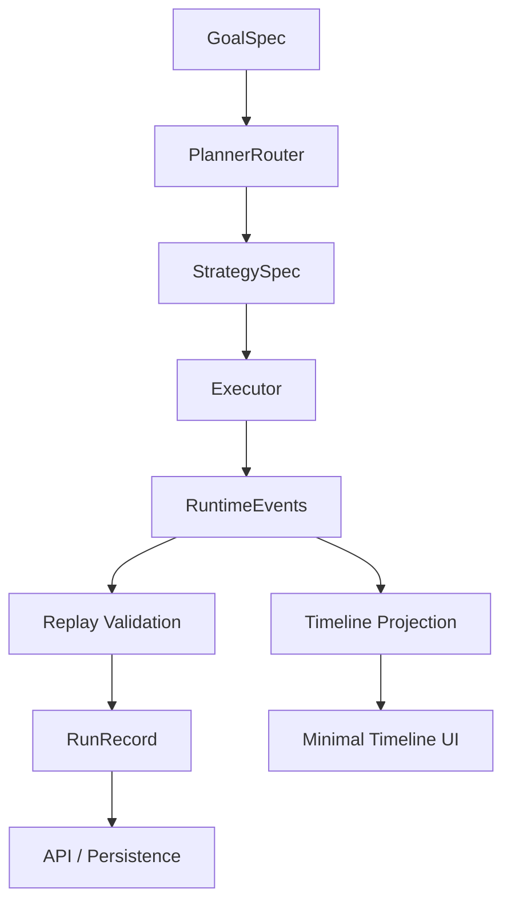
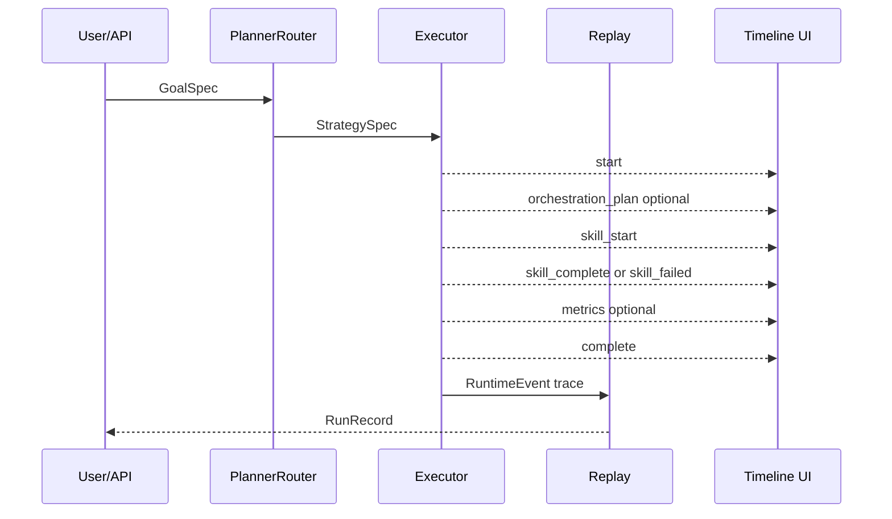
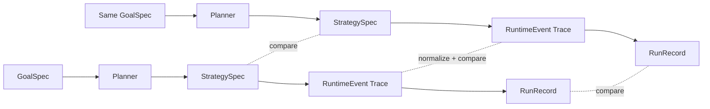

# UAR Runtime Math and Visualization Foundation

## Purpose

This document defines the immediate-side math and visualization layer for UAR.

It intentionally stays inside the runtime substrate:

```text
GoalSpec -> PlannerRouter -> StrategySpec -> Executor -> RuntimeEvents -> Replay -> RunRecord -> Timeline
```

Observer systems, DSE overlays, semantic evaluators, memory graph cognition, symbolic overlays, and multi-agent orchestration are other-side modules. They may consume this substrate later, but they must not redefine it.

---

## 1. Runtime as a Transition System

UAR can be modeled as a bounded transition system.

```text
S_t + E_t -> S_{t+1}
```

Where:

- `S_t` is runtime state at time/index `t`
- `E_t` is the RuntimeEvent emitted at time/index `t`
- `S_{t+1}` is the reconstructed state after applying the event

Immediate implication:

```text
same initial state + same event sequence -> same reconstructed RunRecord
```

This is the basis of replay certification.

---

## 2. Core Objects

### GoalSpec

Normalized intent.

```text
G = (id, objective, constraints, success_criteria, required_skills, metadata)
```

### StrategySpec

Planner output.

```text
P(G) = Sigma
Sigma = ordered_skills = [s_1, s_2, ..., s_n]
```

### RuntimeEvent

Atomic execution observation.

```text
e_i = (schema_version, type, run_id, goal_id, skill, timestamp, payload, error, metadata*)
```

Metadata is optional and additive. It must not be required for replay correctness.

### Event Trace

```text
T = [e_0, e_1, ..., e_k]
```

A valid immediate-side trace satisfies:

```text
e_0.type = start
e_k.type = complete
forall e_i: e_i.run_id = constant
forall e_i: e_i.goal_id = constant
forall e_i: e_i.schema_version = uar.event.v1
```

### RunRecord

Replay-derived durable artifact.

```text
R = Replay(T)
```

---

## 3. Determinism Targets

### Planner Determinism

For deterministic modes:

```text
P_simple(G) = P_simple(G)
```

Same `GoalSpec` must produce the same `StrategySpec`.

### Replay Determinism

```text
Replay(T) = Replay(T)
```

Same event trace must reconstruct the same `RunRecord`.

### Timeline Projection Determinism

```text
Timeline(T) = Timeline(T)
```

Same event trace must produce the same UI-safe timeline projection.

---

## 4. Event Algebra

RuntimeEvents form an ordered trace algebra.

### Event Concatenation

```text
T = [start] + body + [complete]
```

### Valid Trace Predicate

```text
Valid(T) :=
  len(T) > 0
  and first(T).type = start
  and last(T).type = complete
  and single_run_id(T)
  and single_goal_id(T)
  and schema(T) = uar.event.v1
```

### Replay Function

```text
Replay: Trace -> RunRecord
```

Replay must be pure with respect to the trace. It must not re-execute skills.

### Timeline Projection

```text
Project: Trace -> Timeline
```

Projection is lossy by design. It extracts UI-safe chronological entries from the authoritative event trace.

---

## 5. Minimal Visualizations Needed Now

### A. Runtime Spine Diagram

Purpose: explain architecture.



### B. Event Lifecycle Diagram

Purpose: explain valid event order.



### C. Replay Certification Diagram

Purpose: explain deterministic certification.



Note: timestamps and generated IDs may need normalization for trace comparison.

---

## 6. Minimal UI Needed Now

The first UI should be boring and useful.

### Required Panels

```text
Run Header
- run_id
- goal_id
- status
- event_count
- started_at / completed_at when available

Timeline
- index
- timestamp
- event type
- skill
- status/error

Details Drawer
- selected event payload
- error field
- correlation_id if present

Summary
- skill starts
- skill completes
- failures
- outputs
```

### Explicitly Not Included Yet

```text
DSE overlays
observer scoring
semantic quality labels
memory graph projections
symbolic/cognitive visualization
multi-agent graph animation
```

These belong to other-side modules.

---

## 7. Data Shape for Timeline UI

`uar/core/timeline.py` projects RuntimeEvents into:

```json
{
  "index": 0,
  "type": "skill_start",
  "timestamp": 0.0,
  "skill": "section_sum",
  "error": null,
  "payload": {}
}
```

The UI should consume this projection rather than inventing its own event interpretation rules.

---

## 8. Certification Checklist

Immediate-side closure requires:

```text
[ ] PlannerRouter deterministic mode tests pass
[ ] RuntimeConfig validation tests pass
[ ] RuntimeEvent builder tests pass
[ ] Replay integrity tests pass
[ ] Timeline projection tests pass
[ ] make gate passes
[ ] executor _event helper is migrated to make_executor_event locally
[ ] minimal timeline UI consumes timeline projection or equivalent API payload
```

---

## 9. Guiding Rule

```text
Make execution truth undeniable before adding intelligence around it.
```
